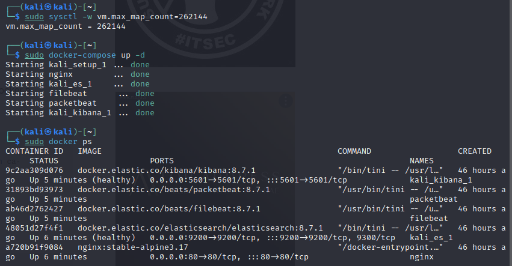

# Развертывание системы мониторинга ELK Stack

## Цель работы

1. Освоить базовые подходы централизованного сбора и накопления информации

2. Освоить современные инструменты развертывания контейнирозованных приложений

3. Закрепить знания о современных сетевых протоколах прикладного уровня

## Ход выполнения практической работы

### Задание 1. Развернуть систему мониторинга на базе ElasticSearch

1. Настройка

    Для работы ElasticSearch требуется увеличить размер виртуальной памяти системы:
    ```
    sudo sysctl -w vm.max_map_count=262144
    ```
    Далее следуем инструкции по ссылке: https://www.elastic.co/guide/en/elasticsearch/reference/current/docker.html

2. После формирования файлов с конфигурациями, нужно запустить образы командой
    ```
    docker-compose up -d
    ```
    

3. Переходим на `localhost:5061` и авторизируемся 

    

4. Проверям, что установленны все средства для сбора информации из файлов журналов и сбора аналитики трафика

    

5. Создаем новый data view для filebeat

    

6. Создаем новый data view для packetbeat

    

## Оценка результата

    Была развёрнута система ElasticSearch и настроена система сбора трафика и лог-файлов.

## Вывод

    В результате работы была освоена система контейнеризации приложений Docker, работа с Docker-compose и освоена система централизованного сбора и накопления информации ElasticSearch.
